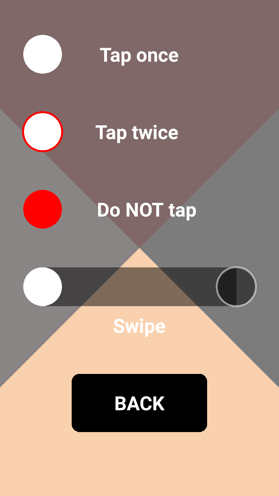
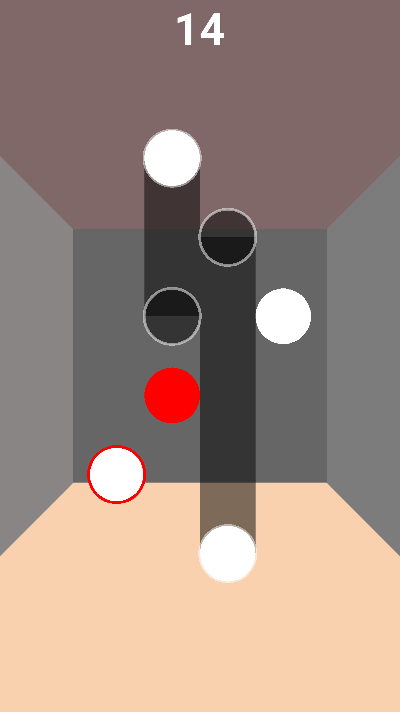

### App Name
Wall Buster

### Description
This game is a puzzle that has different patterns that the player/user needs to trace on the screen in limited time before the wall crashes into him. There are dots which need to be tapped once and twice and swipes across the screen which are to be traced in a pattern.
Each level has a dynamically changing time limit that the wall takes to crash and the user has to complete the whole puzzle before the time expires. On completion of each puzzle , the user progresses to the next level , which is harder and faster.

### Team Members
Abdul Rabbani Shah, Anirudh Singh Shekhawat

### Screenshots

